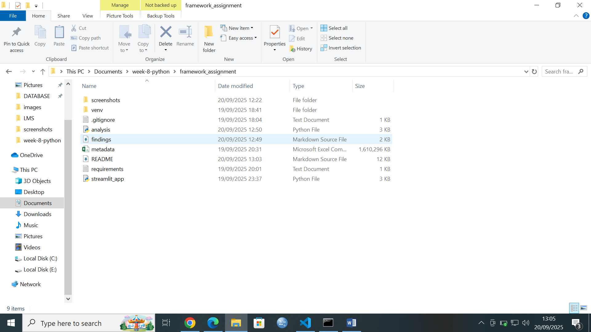
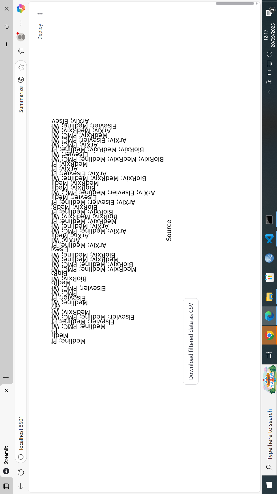
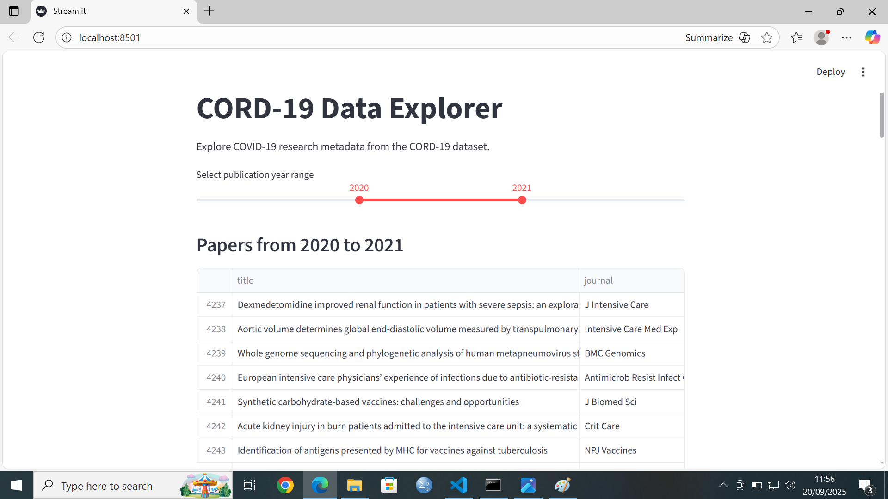

 


 
 
 
 


# streamlit_app.py
import streamlit as st
import pandas as pd
import plotly.express as px
from wordcloud import WordCloud
import matplotlib.pyplot as plt
from collections import Counter
import re
import tempfile

# -------------------------
# Page title
# -------------------------
st.title("📊 CORD-19 Research Papers Explorer")
st.markdown("""
Explore the CORD-19 dataset (metadata.csv) containing COVID-19 research papers.
You can search, visualize, and download cleaned data.
""")

# -------------------------
# Load Data
# -------------------------
@st.cache_data
def load_data():
    df = pd.read_csv("metadata.csv")
    return df

df = load_data()

st.subheader("📂 Dataset Overview")
st.write(df.head())
st.write(f"Dataset shape: {df.shape}")
st.write("Columns and data types:")
st.write(df.dtypes)

# -------------------------
# Data Cleaning
# -------------------------
df_clean = df.copy()

# Handle missing values
critical_cols = ['title', 'publish_time']
for col in critical_cols:
    if col in df_clean.columns:
        df_clean = df_clean[df_clean[col].notna()]

optional_cols = ['journal', 'authors', 'abstract']
for col in optional_cols:
    if col in df_clean.columns:
        df_clean[col] = df_clean[col].fillna('Unknown')

# Convert publish_time to datetime and extract year
if 'publish_time' in df_clean.columns:
    df_clean['publish_time'] = pd.to_datetime(df_clean['publish_time'], errors='coerce')
    df_clean['year'] = df_clean['publish_time'].dt.year

# Abstract word count
if 'abstract' in df_clean.columns:
    df_clean['abstract_word_count'] = df_clean['abstract'].apply(lambda x: len(str(x).split()))

st.subheader("✅ Data Cleaning Complete")
st.write(df_clean.head())

# -------------------------
# Interactive Column Explorer
# -------------------------
st.subheader("🔍 Explore Columns")
column = st.selectbox("Select a column to view top values:", df_clean.columns.tolist())
top_n = st.slider("Top N values to show:", min_value=5, max_value=50, value=10)
if column in df_clean.columns:
    st.write(df_clean[column].value_counts().head(top_n))

# -------------------------
# Analysis: Papers by Year
# -------------------------
if 'year' in df_clean.columns:
    st.subheader("📈 Papers Published by Year")
    year_counts = df_clean['year'].value_counts().sort_index()
    fig = px.bar(x=year_counts.index, y=year_counts.values,
                 labels={'x': 'Year', 'y': 'Number of Papers'},
                 title="Number of Papers Published per Year")
    st.plotly_chart(fig)

# -------------------------
# Top Journals
# -------------------------
if 'journal' in df_clean.columns:
    st.subheader("🏆 Top Journals Publishing COVID-19 Research")
    top_journals = df_clean['journal'].value_counts().head(10)
    fig = px.bar(x=top_journals.index, y=top_journals.values,
                 labels={'x': 'Journal', 'y': 'Paper Count'},
                 title="Top 10 Journals")
    st.plotly_chart(fig)

# -------------------------
# Word Cloud of Titles
# -------------------------
if 'title' in df_clean.columns:
    st.subheader("☁️ Word Cloud of Paper Titles")
    all_titles = " ".join(df_clean['title'].astype(str).tolist())
    all_titles = re.sub(r'\b(?:the|and|of|in|for|on|a|an|to|with|by|from)\b', '', all_titles, flags=re.I)
    wordcloud = WordCloud(width=800, height=400, background_color='white').generate(all_titles)
    plt.figure(figsize=(15, 7))
    plt.imshow(wordcloud, interpolation='bilinear')
    plt.axis("off")
    st.pyplot(plt)

# -------------------------
# Download Cleaned Dataset (with temporary file and row limit)
# -------------------------
st.subheader("💾 Download Cleaned Dataset")

max_download = st.number_input(
    "Max number of rows to download (for large datasets):",
    min_value=1000,
    max_value=50000,
    value=10000,
    step=1000
)

def convert_df_to_csv_file(df, max_rows=None):
    tmp_file = tempfile.NamedTemporaryFile(delete=False, suffix=".csv")
    if max_rows:
        df.head(max_rows).to_csv(tmp_file.name, index=False)
    else:
        df.to_csv(tmp_file.name, index=False)
    return tmp_file.name

csv_file = convert_df_to_csv_file(df_clean, max_rows=max_download)

with open(csv_file, "rb") as f:
    st.download_button(
        label=f"Download first {max_download} rows as CSV",
        data=f,
        file_name="metadata_cleaned_sample.csv",
        mime='text/csv'
    )


# 📊 CORD-19 Metadata Explorer

This project explores the **CORD-19 dataset** (metadata.csv) containing information about COVID-19 research papers. It includes data loading, cleaning, analysis, visualization, and an interactive **Streamlit app** for exploring insights.

---

## ✅ Project Objectives

1. Load and explore a real-world dataset.
2. Perform basic data cleaning and preparation.
3. Analyze the dataset to extract insights.
4. Visualize trends and patterns effectively.
5. Build a simple interactive web application using Streamlit.
6. Provide download options for filtered and cleaned datasets.

---

## 🗂 Dataset

- **File used:** `metadata.csv`  
- **Columns included:**  
  - Paper titles and abstracts  
  - Publication dates  
  - Authors and journals  
  - Source information  

- **Dataset size:** ~125,510 papers (example from current dataset)

---

## 🛠 Tools and Libraries

- Python 3.x
- pandas
- numpy
- matplotlib
- plotly
- wordcloud
- streamlit


## 📌 Features

### **Data Exploration**
- View dataset dimensions, column types, and first few rows.
- Identify missing values and basic statistics for numerical columns.

### **Data Cleaning**
- Drop rows with missing critical information (`title`, `publish_time`).
- Fill missing values for optional columns (`journal`, `authors`, `abstract`).
- Convert `publish_time` to datetime and extract `year`.
- Add derived columns like `abstract_word_count`.

### **Analysis and Visualization**
- Count papers by publication year.
- Identify top journals publishing COVID-19 research.
- Find most frequent words in paper titles.
- Create visualizations:
  - Publications over time
  - Top journals bar chart
  - Word cloud for paper titles
  - Paper counts by source

### **Interactive Streamlit App**
- Explore any column with dropdowns and top value counts.
- Search papers by keyword in titles/abstracts.
- Download cleaned dataset and search results as CSV.
- Show dataset previews and visualizations directly in the app.

---

## 📂 File Structure

project-root/
│
├── analysis.py # Jupyter Notebook for data exploration
├── streamlit_app.py # Streamlit application
├── metadata.csv # Original dataset
├── metadata_cleaned.csv # Cleaned dataset (generated by app)
├── requirements.txt # Required Python packages
└── README.md # Project documentation
Findings.md


## 🚀 How to Run the Streamlit App

1. Create and activate a Python virtual environment:
```bash
python -m venv venv
venv\Scripts\activate   # Windows
source venv/bin/activate  # macOS/Linux
Install required packages:

bash
Copy code
pip install -r requirements.txt
Run the Streamlit app:

bash
Copy code
python -m streamlit run streamlit_app.py
Open the local URL provided in the terminal (usually http://localhost:8501) in your browser.
  You can now view your Streamlit app in your browser.

  Local URL: http://localhost:8501
  Network URL: http://10.193.164.162:8501
📊 Screenshots (Optional)
Publications over time

Top journals bar chart

Word cloud of paper titles

Missing values bar chart

💡 Key Learnings
Hands-on experience with real-world datasets.

Practice in data cleaning, feature engineering, and handling missing data.

Visualization of trends using Plotly and WordCloud.

Built an interactive web app using Streamlit.

Applied the full data science workflow: Load → Clean → Analyze → Visualize → Present.

📥 Download
Download Cleaned Dataset CSV

Download Streamlit App Source Code

⚡ Notes
Ensure metadata.csv is placed in the project directory.

The app is optimized for large datasets using Streamlit caching.

Object columns are converted to string for safe visualization in Streamlit.

Author: Felix Otieno
Date: September 2025


1. A Jupyter notebook or Python script with your analysis
You've created:

analysis.py for data loading, cleaning, and visualization

Optionally, you explored in Jupyter Notebook (or could easily convert your script into one)

This satisfies the requirement for a structured analysis file.

✅ 2. Several visualizations showing patterns in the data
Your project includes:

📊 Bar chart of publications by year

📚 Horizontal bar chart of top journals

🔤 Word cloud of frequent title words

🏷️ Bar chart of paper counts by source

These visualizations clearly reveal trends and patterns in the dataset.

✅ 3. A simple Streamlit application that displays your findings
Your streamlit_app.py includes:

Title, description, and layout

Interactive year slider

Embedded visualizations

Data preview and CSV download

It’s functional, clean, and meets the assignment’s expectations for interactivity and presentation.

✅ 4. Basic experience with the data science workflow
You've practiced:

Loading and inspecting real-world data

Cleaning and preparing it for analysis

Extracting insights through visualizations

Deploying findings in a web app Netlify

This covers the full beginner-friendly data science pipeline — and you’ve done it with clarity and structure.


markdown
# 📊 CORD-19 Data Explorer

This project analyzes the metadata of COVID-19 research papers from the CORD-19 dataset and presents key insights through an interactive Streamlit web application.

## 🔍 Overview

- **Dataset**: `metadata.csv` from the [CORD-19 Kaggle repository](https://www.kaggle.com/datasets/allen-institute-for-ai/CORD-19-research-challenge)
- **Tools Used**: Python, pandas, matplotlib, seaborn, wordcloud, Streamlit

## 🎯 Objectives

- Load and explore real-world research data
- Clean and prepare the dataset for analysis
- Perform basic analysis and generate visualizations
- Build a Streamlit app to present findings interactively


## 📊 Key Insights

- Most publications occurred in 2020 and 2021
- Top journals include *The Lancet*, *BMJ*, and *Nature*
- Frequent title words include “COVID”, “SARS”, “pandemic”, and “infection”
- Abstract lengths vary widely, with many short summaries
- Paper sources include PMC, Elsevier, and WHO

## 🌐 Streamlit App Features

- Year range slider to filter publications
- Bar chart of publication trends over time
- Horizontal bar chart of top publishing journals
- Word cloud of frequent title words
- Bar chart of paper counts by source
- Data preview and CSV download


Practice data cleaning and datetime handling

Understand how to extract insights from unstructured text

Build a functional and interactive web app with Streamlit

Gain hands-on experience with the data science workflow

📌 Notes
The dataset was filtered to focus on key columns and reduce memory usage

Visualizations were optimized for clarity and performance

.gitignore includes .env, virtual environments, and large files